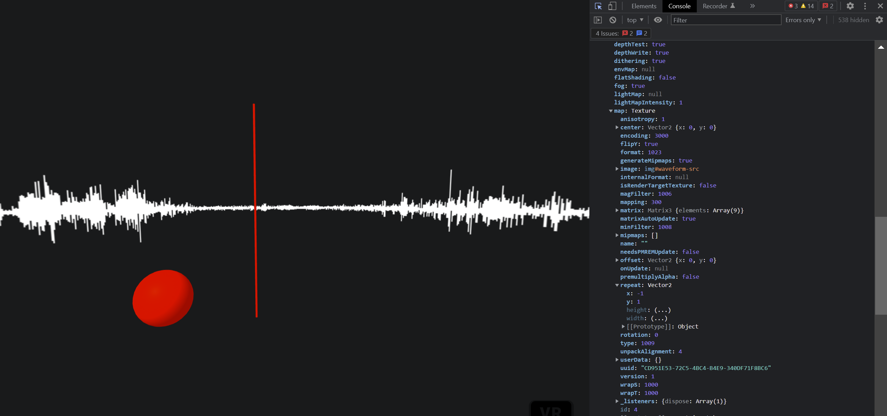
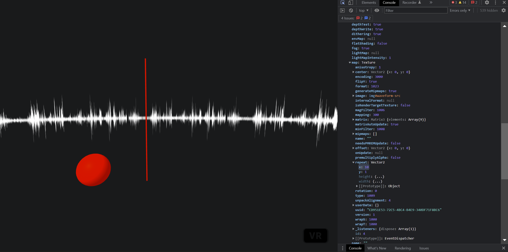
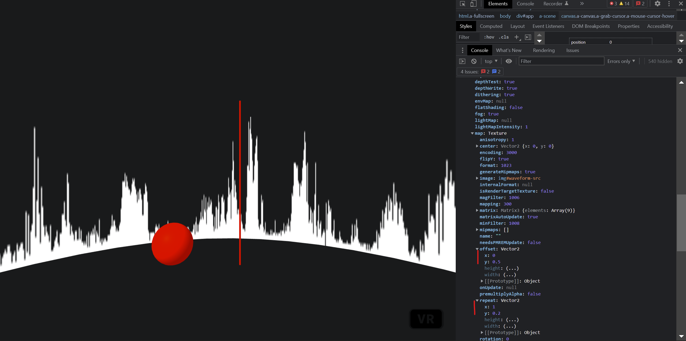
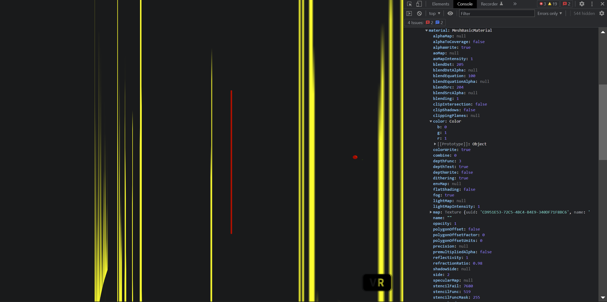
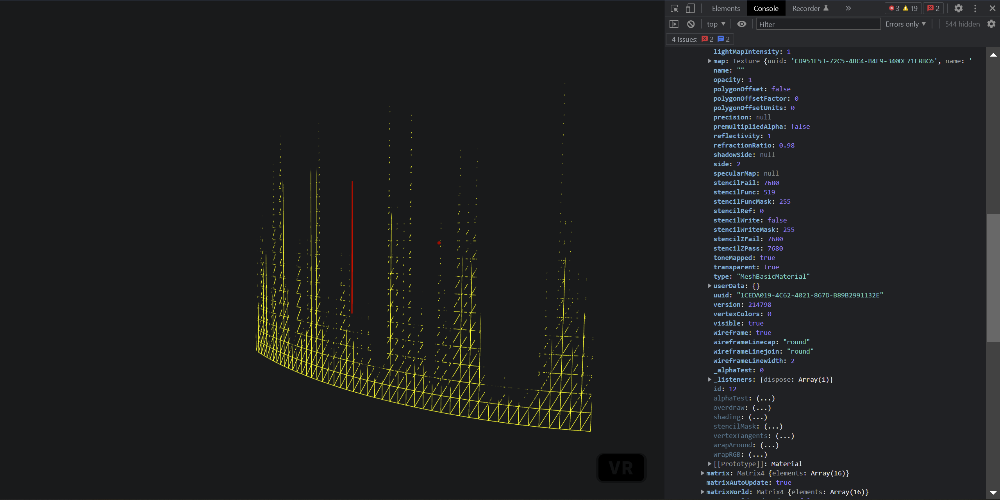
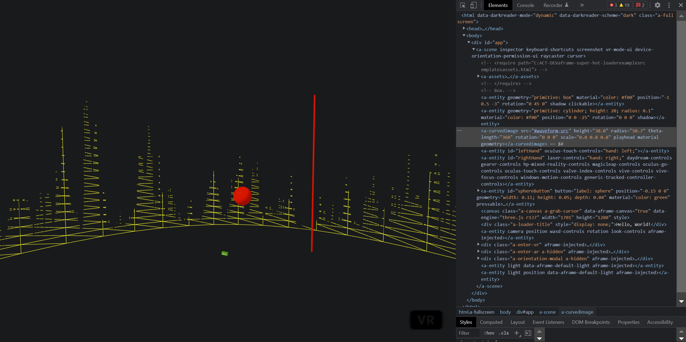
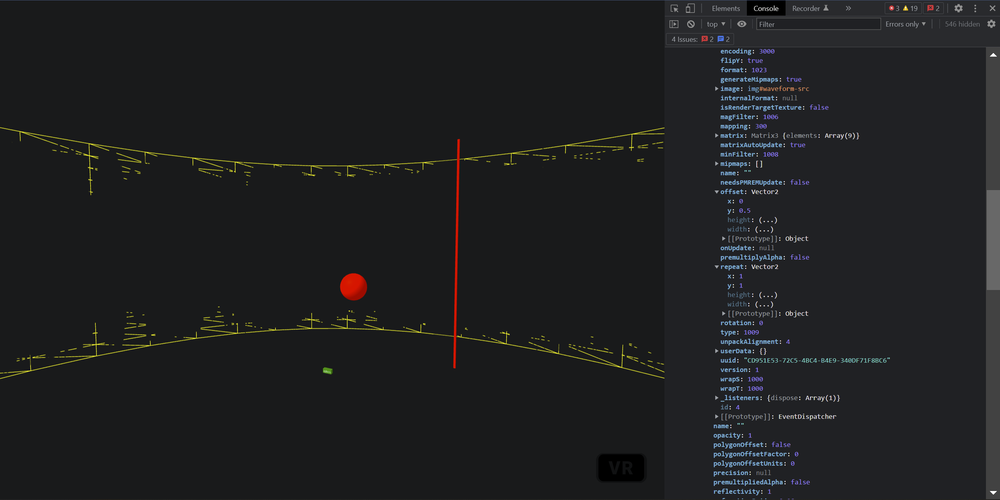

# How to manipulate texture coordinates in A-Frame/Three.js?


.repeat - How many times the texture is repeated across the surface, in each direction U and V.

.offset - How much a single repetition of the texture is offset from the beginning, in each direction U and V. Typical range is 0.0 to 1.0.

.wrapS - The default is THREE.ClampToEdgeWrapping, where the edge is clamped to the outer edge texels. The other two choices are THREE.RepeatWrapping and THREE.MirroredRepeatWrapping.

.wrapT - The default is THREE.ClampToEdgeWrapping, where the edge is clamped to the outer edge texels. The other two choices are THREE.RepeatWrapping and THREE.MirroredRepeatWrapping.

NOTE: tiling of images in textures only functions if image dimensions are powers of two (2, 4, 8, 16, 32, 64, 128, 256, 512, 1024, 2048, ...) in terms of pixels. Individual dimensions need not be equal, but each must be a power of two. This is a limitation of WebGL, not Three.js.

Example of scale:

```js
// scale x2 horizontal
texture.repeat.set(0.5, 1);
// scale x2 vertical
texture.repeat.set(1, 0.5);
// scale x2 proportional
texture.repeat.set(0.5, 0.5);
```

https://stackoverflow.com/questions/33803280/three-js-how-do-i-scaling-and-offset-my-image-textures#33803779

https://threejs.org/docs/#api/en/textures/Texture

## In A-Frame

### Modifying repeat

On curvedimage:

`el.object3D.children[0].material.map.repeat`







