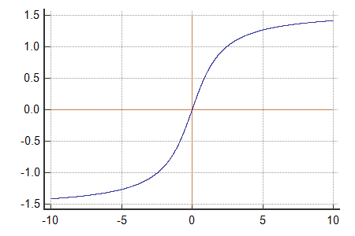
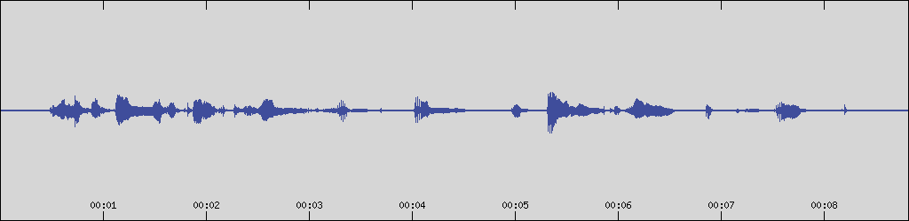

# Selecting a point on a-curvedimage


The THREE.JS Raycaster is able to provide exact point of intersection. Have to figure out how to reach that from A-Frame `laser-controls` but in principle this should allow us to:

1. Cast a ray through the `a-curvedimage`
2. Get the intersection position
3. Lose the y (height) element and be left with x,z
4. Transform from cartesian to polar coordinates using the known a-curvedimage center, getting the angle `alpha`
5. Normalize `alpha` into 0-1
6. Multiply with audio duration to get selected position

## Cast a ray through `a-curvedimage`

`raycaster` in A-Frame comes in the form of a component (how else?) - https://aframe.io/docs/1.3.0/components/raycaster.html

```js
AFRAME.registerComponent('raycaster-listen', {
	init: function () {
    // Use events to figure out what raycaster is listening so we don't have to
    // hardcode the raycaster.
    this.el.addEventListener('raycaster-intersected', evt => {
      this.raycaster = evt.detail.el;
    });
    this.el.addEventListener('raycaster-intersected-cleared', evt => {
      this.raycaster = null;
    });
  },

  tick: function () {
    if (!this.raycaster) { return; }  // Not intersecting.

    let intersection = this.raycaster.components.raycaster.getIntersection(this.el);
    if (!intersection) { return; }
    console.log(intersection.point);
  }
});

// <a-entity id="raycaster" raycaster></a-entity>
// <a-entity geometry material raycaster-listen></a-entity>
```

Ok, attaching this component to the curvedimage seems to work just fine with the mouse cursor. (Image is missing due to disconnected external drive)


So this covers also #2

## Cartesian to Polar transform

https://stackoverflow.com/questions/37667438/convert-three-js-scene-rotation-to-polar-coordinates

https://en.wikipedia.org/wiki/Polar_coordinate_system


We don't really care about the radius so to calculate the angle we can do simply:

```
phi = atan2(y, x)
```

Or in our  case

```js
const { x, z } = intersection.point;
const alpha = Math.atan2(z, x);
```

Seems to be working out well. Results are in radians and go to negative, see the graph of atan2 function:




While this is very cool and all this advanced high school math makes us feel very smart, there may actually be a simpler way.

## UV coordinates

You see, the Intersection object returned from the raycaster also includes the UV coordinates.


<figcaption>
Yup, there it is.
</figcaption>

What are UV coordinates you ask? These are values used to relate from geometry to a position in an applied texture. Basically the existence of these UV coordinates on our curvedimage allows it to be preceisely filled in by the waveform image (if I didn't disconnect my drive and it loaded properly).

So getting the UV coordinates basically means that we know exactly where on the texture we're pointing. This way we'll be resistant to any geometry changes and always match up perfectly with what the texture is displaying. Therefore we could even introduce all sorts of bendy geometries without having to get a major in mathematics.

And if we end up implementing zooming by scaling the texture, the selection will follow for free. Or maybe not, does map scaling affect the returned UV? Likely not, drop this thought out of your head, it's pure lunacy. Anyways, ...

Let's see if it works. For better visibility, I'll also record a little sample and generate a waveform since I'm too comfy together with humi to get off the couch and get the external drive with all the content from the other room.

1. Audacity
   
2. ```
   audiowaveform -i .\a-little-fun.wav -o .\a-little-fun.png -z auto -w 1024
   ```
   
3. ```
   python -m http.server
   ```
4. Magic
    

So, to see the uv results we can simply adjust our logging like so:

```js
console.log(intersection.uv);
```

And it works! However, there is one peculiar finding, can you spot it?

 

The `x` (u) coordinates seems to run backwards!

As the waveform goes on, the `x` (u) value actually decreases, starting at 1 and ending at 0.

Armed with that knowledge we should be able to devise the devious formula to get from UV to seconds in our incredible audio recording.

Flip the reversed x value using `1-x`.

Multiply by the sample duration.

And...

That's it.

```js
const { x } = intersection.uv
const targetTime = (1-x) * audioEl.duration
```


Yup.

## Moving to the selected position

With a little refactoring to use the intersected position only on `click` and properly using the `events` field which everyone is so secretive about, we get this:

```js
AFRAME.registerComponent("raycaster-listen", {
  init: function () {
    this.audioEl = document.querySelector("#audio-src");
  },
  events: {
    "raycaster-intersected": function (evt) {
      this.raycaster = evt.detail.el;
    },
    "raycaster-intersected-cleared": function (evt) {
      this.raycaster = null;
    },
    "click": function (evt) {
        if (!this.raycaster) {
        return;
        } // Not intersecting.
        this.audioEl.currentTime = this.getSelectedAudioTime()
    }
  },
  getSelectedAudioTime: function () {
    let intersection = this.raycaster.components.raycaster.getIntersection(
      this.el
    );
    if (!intersection) {
      return;
    }
    const { x } = intersection.uv;
    return (1 - x) * this.audioEl.duration;
  },
});
```

And indeed, it works.

![[Hello, World! - Google Chrome 2022-02-28 19-55-31.mp4]]

 Although, I do think, you'll agree I'm sure, that the jumps are pretty jarring.
 
 Maybe, this full circle tape-like rotating view makes sense only as non-interactive. For interactive purposes a moving playhead may be more fitting.
 
## Moving playhead

Since the current `playhead` component is implemented using rotation, it might be enough to move it from the curvedimage to a new entity and place the red marker line as a child under that new entity. And it should be just perfect:

```html
  <a-entity playhead>
    <a-entity
      geometry="primitive: cylinder; height: 20; radius: 0.1"
      material="color: #f00"
      position="0 0 -50"
      rotation="0 0 0"
      shadow
    ></a-entity>
  </a-entity>
```

![[Hello, World! - Google Chrome 2022-02-28 20-12-19.mp4]]

Ok, not quite, maybe we should be rotating the opposite direction and fix up the origins. And fetching a charger might also be a good idea judging by the capture choppiness.

![[Hello, World! - Google Chrome 2022-02-28 20-16-14.mp4]]

Closer, but no cigar.


YES FFS...


Alright, now that we infinite energy, let's tune it out. With the help of Mr. Inspector! (`Ctrl+Alt+I`)


![[Hello, World! - Google Chrome 2022-02-28 20-26-48.mp4]]

Oh it actually already matches up. Did it just need a refresh? Still, the 0 is off.

Let's refresh and find the correct starting rotation for the curvedimage using the Inspector again.


These are our starting positions. I would have expected a straight 90 degree difference, but this seems slightly more, curious!


Where is this 100 degree rotation coming from?!

```html
  <!-- scene.html -->
  <a-curvedimage
    ...
    rotation="0 100 0"
    ...
  ></a-curvedimage>
```

Ehm. I was sure I checked there already, well let's get rid of that silly line.


Badum, tss! Perfect match!

![[Hello, World! - Google Chrome 2022-02-28 20-32-47.mp4]]

---

What's next?